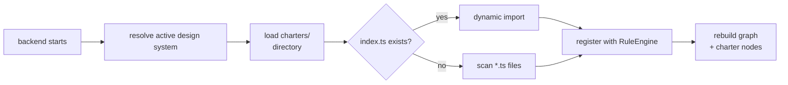

# Element Charters (EC) — Design-System-Defined Rule Sets

> **Status:** Proposal  
> **Applies to:** `@emdesign/graph`, `@emdesign/dsr`, `@emdesign/backend`  
> **Alias:** EC (Element Charter)  
> **Inspired by:** User stories in agile — design system elements as characters with behavioral expectations.

## 1. The Problem

Today, emdesign's validation rules are **hardcoded in the engine**:

- Anti-slop checks in `packages/dsr/src/rules/lint.ts` (regex patterns over source code)
- Token-contract rules in `packages/graph/src/rules.ts` (static `RULES` array)
- Production-readiness checks in design review rules (`packages/dsr/src/rules/review.ts`)

While the **plugin system** (`packages/backend/src/plugins/`, `packages/plugin-api/src/index.ts`) lets framework-level rules aggregate across a stack, **every design system that uses the same plugin stack gets the same rules**. There is no way for a specific design system — say, "Atelier" — to say:

> _"In our system, a Button must have padding ≥ 12px/20px, headings must always use Newsreader, and the accent color may appear at most twice per screen."_

These are **design-system-specific behavioral contracts** that belong alongside the DESIGN.md and tokens.css, not in the engine's source code.

## 2. The Concept: Element Charters

### 2.1 Metaphor

Just as a **user story** in agile captures what a user needs ("As a user, I want to reset my password so that I can regain access"), an **Element Charter (EC)** captures what a design-system element needs:

> **"As a Button, I want padding of at least 12px/20px so that touch targets are accessible."**

The design system's elements — tokens, primitives, components, views — each have a **character** (role, behavior, constraints). An Element Charter is the formal encoding of that element's behavioral contract.

### 2.2 Why "Charter"?

- A charter is a **formal document** defining rights, responsibilities, and constraints — exactly what a design system element needs
- An **Element Charter** codifies what an element **must** and **must not** do
- Each charter is a first-class, testable contract alongside the DESIGN.md and tokens

### 2.3 Key Insight

Element Charters **extend** (not replace) the existing validation layers:

| Layer | What | Who defines | Example |
|---|---|---|---|
| Built-in lint | Anti-slop + token contract | Engine | "No emoji icons", "No purple gradients" |
| Plugin rules | Framework/library rules | Plugin authors | "No inline styles in shadcn" |
| **Element Charters (graph)** | **Design-system-specific contracts over the knowledge graph** | **Design system authors** | "Button declares padding ≥ 12px/20px" |
| **Element Charters (DOM)** | **Design-system-specific contracts over rendered output** | **Design system authors** | "Rendered Button has computed padding ≥ 12px/20px" |
| Design review | Production-readiness checklist | Plugin authors | "≥14 type-scale rows", "≥7 components" |

Element Charters validate at **two layers**:

- **Graph layer** — what's defined in code (primitives, tokens, compositions, component props). Answers: *"Is the Button's prop declared correctly?"*
- **DOM layer** — what's actually rendered in the browser (computed styles, layout geometry, element hierarchy). Answers: *"Does the rendered Button actually have 12px/20px of padding?"*

A single charter can validate at one layer or both — the matcher determines the layer.

## 3. Anatomy of an Element Charter

### 3.1 TypeScript Interface

```typescript
// packages/dsr/src/charters/charter.ts  (new file)

import type { Graph, GNode, GEdge } from '@emdesign/graph';
import type { RenderSnapshot, RenderNode } from '../rules/rendered.js';

// ---------------------------------------------------------------------------
// Shared types
// ---------------------------------------------------------------------------

/**
 * The severity of an Element Charter finding.
 * Reuses the same P0/P1/P2 scale as the rest of the engine.
 */
export type Severity = 'P0' | 'P1' | 'P2';

/**
 * A single finding from an Element Charter's run().
 * Compatible with Diagnostic from `@emdesign/dsr` so it can feed
 * into the critique pipeline (computeComposite, decideRound).
 */
export interface EcFinding {
  /** Machine-readable id, e.g. "button-padding/atelier/Button" */
  id: string;
  severity: Severity;
  message: string;
  /** The node/edge/selector-id this finding targets */
  target?: string;
  /** How to fix (optional, for agent guidance) */
  remediation?: string;
}

// ---------------------------------------------------------------------------
// Graph layer types
// ---------------------------------------------------------------------------

/**
 * The context passed to an Element Charter's run() when matching at the
 * graph layer. Use `ecType: 'graph'` matchers to receive this context.
 */
export interface EcGraphContext {
  layer: 'graph';
  /** The full design-system graph */
  graph: Graph;
  /** The matched node/edge ids this charter applies to */
  matched: string[];
  /** All nodes matched by the charter's matcher */
  matchedNodes: GNode[];
  /** All edges matched (for edge matchers) */
  matchedEdges: GEdge[];
}

// ---------------------------------------------------------------------------
// DOM layer types
// ---------------------------------------------------------------------------

/**
 * A matched DOM element — wraps the raw RenderNode with convenience accessors
 * for traversal (parent, children, siblings) and computed style queries.
 */
export interface EcDomNode {
  /** The raw render-probe data (selector, tag, classes, text, box, styles) */
  node: RenderNode;
  /** Direct children of this element (matched within the same snapshot) */
  children: EcDomNode[];
  /** Parent element, if any */
  parent: EcDomNode | null;
  /** Sibling elements (same parent, excluding this one) */
  siblings: EcDomNode[];
}

/**
 * The context passed to an Element Charter's run() when matching at the
 * DOM layer. Use `ecType: 'dom'` matchers to receive this context.
 */
export interface EcDomContext {
  layer: 'dom';
  /** The full design-system graph (still available for cross-reference) */
  graph: Graph;
  /** One or more render snapshots the charter runs against */
  renders: RenderSnapshot[];
  /** The matched DOM elements (from all snapshots) */
  matchedElements: EcDomNode[];
}

/**
 * Union of all possible Element Charter contexts.
 * The layer is determined by the matcher type.
 */
export type EcContext = EcGraphContext | EcDomContext;

// ---------------------------------------------------------------------------
// Matcher types
// ---------------------------------------------------------------------------

/**
 * A matcher identifies which element(s) an Element Charter applies to.
 * The matcher type determines which layer (graph or DOM) the charter runs on.
 *
 * Graph layer matchers:
 * - `node`: match all graph nodes of a given label + optional property filter
 * - `edge`: match all graph edges of a given label + optional property filters
 * - `subgraph`: hand a function the full graph and get back subgraph matches
 * - `custom`: arbitrary programmatic match returning node/edge IDs
 *
 * DOM layer matchers:
 * - `dom-selector`: standard CSS selector against the rendered DOM
 * - `dom-relation`: select elements by their relationship to another selector
 *   (parent, children, siblings, ancestors)
 */
export type EcMatcher =
  // ── Graph layer ──
  | { type: 'node'; label: string; where?: Record<string, unknown> }
  | { type: 'edge'; label: string; fromWhere?: Record<string, unknown>; toWhere?: Record<string, unknown> }
  | { type: 'subgraph'; pattern(g: Graph): Array<{ label: string; nodes: GNode[]; edges: GEdge[] }> }
  | { type: 'custom'; match(g: Graph): string[] }
  // ── DOM layer ──
  | { type: 'dom-selector'; selector: string }
  | { type: 'dom-relation'; selector: string; relation: 'parent' | 'children' | 'siblings' | 'ancestors'; of: string };

/**
 * An Element Charter (EC) — the fundamental unit of design-system-specific validation.
 *
 * Each charter is a self-contained module that:
 * 1. Declares which element(s) it applies to (via `matcher`)
 * 2. Runs deterministic validation over the graph or rendered DOM (via `run`)
 * 3. Returns findings that plug into the existing critique/scoreboard pipeline
 *
 * The matcher type determines the layer:
 * - `node` | `edge` | `subgraph` | `custom` → graph layer (receives EcGraphContext)
 * - `dom-selector` | `dom-relation` → DOM layer (receives EcDomContext)
 */
export interface ElementCharter {
  /** Unique kebab-case identifier, e.g. "button-padding", "heading-font" */
  name: string;
  /** Human-readable description, phrased as a charter statement */
  description: string;
  /** Severity level for findings from this charter */
  severity: Severity;
  /** Which element(s) this charter applies to — determines the validation layer */
  matcher: EcMatcher;
  /** Deterministic validation — receives matched elements + full context */
  run(ctx: EcContext): EcFinding[];
}
```

### 3.2 Contract

An Element Charter **must**:

1. Be **deterministic**: given the same graph or render snapshot, `run(ctx)` always returns the same findings
2. Be **side-effect-free**: `run(ctx)` must not mutate the graph, the DOM, or any external state
3. Be **fast**: `run(ctx)` should complete in under ~50ms for graph-level charters, under ~200ms for DOM-level charters
4. **Not depend on external services**: no network calls, no LLM, no file system access
5. **Handle missing data gracefully**: if render snapshots are unavailable, DOM-level charters return an empty findings array (not an error)

An Element Charter **may**:

- Use the full graph API (`nodes()`, `edges()`, `traverse()`, `out()`, `in()`) for cross-reference even in DOM-level charters
- Target the same element as another charter (findings compose)
- Use DOM selector utilities (see section 14 for the built-in query API)
- Return zero findings when all expectations are met

## 4. Directory Structure

Element Charters live alongside the design system they belong to:

```
design-systems/<id>/
  DESIGN.md
  tokens.css
  manifest.json
  graph.json
  code/
    Button.tsx
    Card.tsx
    ...
  charters/                      ← NEW directory (Element Charters)
    index.ts                     ← aggregates all charters for this DS
    button-padding.ts            ← "As a Button, I want padding at least 12px/20px"
    heading-font.ts              ← "As a Heading, I want to use the display font"
    accent-usage.ts              ← "As Accent, I want ≤2 appearances per screen"
    card-padding.ts              ← "As a Card, I want 24px padding and hairline border"
    touch-targets.ts             ← "As interactive elements, I want ≥44px tap targets"
    ...
```

### 4.1 The `index.ts` Aggregator

```typescript
// design-systems/atelier/charters/index.ts
import type { ElementCharter } from '@emdesign/dsr';
import { buttonPadding } from './button-padding.js';
import { headingFont } from './heading-font.js';
import { accentUsage } from './accent-usage.js';
import { cardPadding } from './card-padding.js';
import { touchTargets } from './touch-targets.js';

export default [
  buttonPadding,
  headingFont,
  accentUsage,
  cardPadding,
  touchTargets,
] satisfies ElementCharter[];
```

## 5. Concrete Examples

### 5.1 Button Padding Charter

This story checks that all `Button` primitives define adequate padding for their variant:

```typescript
// design-systems/atelier/charters/button-padding.ts
import type { ElementCharter, EcContext, EcFinding } from '@emdesign/dsr';

/**
 * "As a Button, I want padding of at least 12px/20px so that
 *  touch targets meet accessibility guidelines."
 */
export const buttonPadding: ElementCharter = {
  name: 'button-padding',
  description: 'As a Button, I want minimum 12px/20px padding so touch targets are accessible.',
  severity: 'P1',

  // Match all primitive nodes whose name contains "Button"
  matcher: {
    type: 'node',
    label: 'primitive',
    where: { name: /Button/ },
  },

  run(ctx: EcContext) {
    const findings: EcFinding[] = [];
    const MIN_Y = 12; // minimum vertical padding (px)
    const MIN_X = 20; // minimum horizontal padding (px)

    for (const node of ctx.matchedNodes) {
      // Traverse the graph from this primitive node to find padding props
      const props = ctx.graph.out(node.id, 'hasProp');
      const paddingProp = props.find(e =>
        String(e.to).includes('padding')
      );

      // If we have an AST-parsed props node, check its value
      // Otherwise, flag for manual review
      if (!paddingProp) {
        findings.push({
          id: `button-padding/${node.id}`,
          severity: 'P1',
          message: `Button ${node.id} has no declared padding prop. Minimum is ${MIN_Y}px/${MIN_X}px.`,
          target: node.id,
          remediation: `Add padding: '${MIN_Y}px ${MIN_X}px' to the Button component.`,
        });
        continue;
      }

      const paddingNode = ctx.graph.node(paddingProp.to);
      const value = paddingNode?.props?.defaultValue;

      // For variant-specific checks, follow hasVariant edges
      const variants = ctx.graph.out(node.id, 'hasVariant');
      for (const v of variants) {
        const vPadding = ctx.graph.out(v.to, 'hasProp')
          .find(e => String(e.to).includes('padding'));
        // ... check variant-specific padding
      }
    }

    return findings;
  },
};
```

### 5.2 Heading Font Charter

This charter checks that no `Heading` primitive uses a sans-serif font:

```typescript
// design-systems/atelier/charters/heading-font.ts
import type { ElementCharter, EcContext, EcFinding } from '@emdesign/dsr';

export const headingFont: ElementCharter = {
  name: 'heading-font',
  description: 'As a Heading, I want to use the display font so that typographic hierarchy is maintained.',
  severity: 'P0',
  matcher: {
    type: 'node',
    label: 'primitive',
    where: { name: /Heading/i },
  },
  run(ctx) {
    const findings: EcFinding[] = [];
    for (const node of ctx.matchedNodes) {
      const uses = ctx.graph.out(node.id, 'uses');
      const fontToken = uses.find(e =>
        String(e.to).includes('font')
      );
      if (fontToken && !String(fontToken.to).includes('display')) {
        findings.push({
          id: `heading-font/${node.id}`,
          severity: 'P0',
          message: `Heading ${node.id} uses a non-display font token.`,
          target: node.id,
          remediation: 'Use --font-display for heading primitives.',
        });
      }
    }
    return findings;
  },
};
```

### 5.3 Accent Usage Charter

This charter checks that the accent token is used sparingly across the whole design system (not per-component, but across composed artifacts):

```typescript
// design-systems/atelier/charters/accent-usage.ts
import type { ElementCharter } from '@emdesign/dsr';

export const accentUsage: ElementCharter = {
  name: 'accent-restraint',
  description: 'As the Accent token, I want to appear at most 2 times per screen so the system stays restrained.',
  severity: 'P1',
  matcher: {
    type: 'custom',
    match(g) {
      // Match all artifacts + primitives that use the accent token
      const accentToken = g.nodes({ label: 'token', where: { name: 'color-accent' } })[0];
      if (!accentToken) return [];

      // Find everything that transitively references the accent
      const affected = g.traverse(accentToken.id, {
        edgeLabels: ['uses', 'references', 'composes'],
        direction: 'in',
        maxDepth: 5,
      });
      return affected.map(r => r.node.id);
    },
  },
  run(ctx) {
    const accentToken = ctx.graph.nodes({
      label: 'token',
      where: { name: 'color-accent' },
    })[0];
    if (!accentToken) return [];

    // Count accent references per composed artifact
    const countMap = new Map<string, number>();
    for (const id of ctx.matched) {
      const references = ctx.graph.in(id, 'references');
      for (const r of references) {
        if (r.from === accentToken.id) {
          countMap.set(id, (countMap.get(id) ?? 0) + 1);
        }
      }
    }

    return [...countMap.entries()]
      .filter(([_, count]) => count > 2)
      .map(([id, count]) => ({
        id: `accent-restraint/${id}`,
        severity: 'P1',
        message: `Accent token used ${count} times in ${id}; maximum is 2.`,
        target: id,
        remediation: 'Reduce accent usage or use a muted variant.',
      }));
  },
};
```

### 5.4 Subgraph Matcher: Card + Button Composition

A more complex charter using the **subgraph matcher** to find all Cards that compose Buttons and check consistent variant usage:

```typescript
// design-systems/atelier/charters/card-button-consistency.ts
import type { ElementCharter } from '@emdesign/dsr';

export const cardButtonConsistency: ElementCharter = {
  name: 'card-button-variant',
  description: 'As a Card, when I contain a Button, I want both to use the same variant tone.',
  severity: 'P2',
  matcher: {
    type: 'subgraph',
    pattern(g) {
      const matches: Array<{ label: string; nodes: GNode[]; edges: GEdge[] }> = [];
      // Find all Cards
      for (const card of g.nodes({ label: 'primitive', where: { name: /Card/ } })) {
        // Find Buttons composed by this Card
        const composes = g.out(card.id, 'composes');
        for (const edge of composes) {
          const comp = g.node(edge.to);
          if (comp && /Button/i.test(String(comp.props.name))) {
            matches.push({
              label: `card-button:${card.id}->${comp.id}`,
              nodes: [card, comp],
              edges: [edge],
            });
          }
        }
      }
      return matches;
    },
  },
  run(ctx) {
    // ... check variant consistency between Card and its composed Button
    return [];
  },
};
```

### 5.5 DOM Selector: Button Padding (Computed Style)

This charter validates the **rendered** padding of buttons — not just the prop declarations, but what the browser actually computes:

```typescript
// design-systems/atelier/charters/button-padding-dom.ts
import type { ElementCharter, EcDomContext, EcFinding } from '@emdesign/dsr';

/**
 * "As a Button, I want the browser to render at least 12px/20px of padding
 *  so that touch targets are accessible."
 *
 * This runs against the rendered DOM (via Playwright render probe), using a
 * CSS selector to find all buttons and then checking their computed styles.
 */
export const buttonPaddingDom: ElementCharter = {
  name: 'button-padding-dom',
  description: 'As a Button, I want rendered padding ≥ 12px/20px in the browser.',
  severity: 'P1',
  matcher: {
    type: 'dom-selector',
    selector: 'button, [role="button"], .btn-primary, .btn-secondary',
  },
  run(ctx: EcDomContext) {
    const findings: EcFinding[] = [];
    const MIN_Y = 12; // minimum computed padding-top/bottom in px
    const MIN_X = 20; // minimum computed padding-left/right in px

    for (const el of ctx.matchedElements) {
      const padTop = parsePx(el.node.styles.paddingTop);
      const padBottom = parsePx(el.node.styles.paddingBottom);
      const padLeft = parsePx(el.node.styles.paddingLeft);
      const padRight = parsePx(el.node.styles.paddingRight);

      if (padTop < MIN_Y || padBottom < MIN_Y) {
        findings.push({
          id: `button-padding-dom/y/${el.node.selector}`,
          severity: 'P1',
          message: `Button at "${el.node.selector}" has ${padTop}px/${padBottom}px vertical padding; minimum is ${MIN_Y}px.`,
          target: el.node.selector,
          remediation: `Set padding-top and padding-bottom to at least ${MIN_Y}px.`,
        });
      }

      if (padLeft < MIN_X || padRight < MIN_X) {
        findings.push({
          id: `button-padding-dom/x/${el.node.selector}`,
          severity: 'P1',
          message: `Button at "${el.node.selector}" has ${padLeft}px/${padRight}px horizontal padding; minimum is ${MIN_X}px.`,
          target: el.node.selector,
          remediation: `Set padding-left and padding-right to at least ${MIN_X}px.`,
        });
      }
    }

    return findings;
  },
};

// Helper: parse "12px" → 12, "1.5rem" → 24 (assumes 16px base), etc.
function parsePx(val: string): number {
  const match = val.match(/^([\d.]+)(px|rem|em)?$/);
  if (!match) return 0;
  const num = parseFloat(match[1]);
  const unit = match[2];
  if (unit === 'rem' || unit === 'em') return num * 16; // approximate
  return num;
}
```

### 5.6 DOM Relation: Heading → Parent Container

This charter uses the **`dom-relation`** matcher to find all headings and validate that their parent container applies the correct max-width measure (~68ch for Atelier):

```typescript
// design-systems/atelier/charters/heading-measure-dom.ts
import type { ElementCharter, EcDomContext, EcFinding } from '@emdesign/dsr';

export const headingMeasure: ElementCharter = {
  name: 'heading-measure',
  description: 'As a Heading, I want my parent container to cap the reading measure at ~68ch.',
  severity: 'P2',
  matcher: {
    type: 'dom-relation',
    selector: 'h1, h2, h3',
    relation: 'parent',
    of: 'container', // hint: the parent element we care about
  },
  run(ctx: EcDomContext) {
    const findings: EcFinding[] = [];
    for (const el of ctx.matchedElements) {
      // el is the parent container of each heading
      const width = el.node.box.width;
      const fontSize = parsePx(el.node.styles.fontSize) || 16;
      const charWidth = fontSize * 0.6; // approximate character width
      const measure = width / charWidth;

      if (measure > 75) {
        findings.push({
          id: `heading-measure/${el.node.selector}`,
          severity: 'P2',
          message: `Container "${el.node.selector}" has ~${Math.round(measure)}ch; target is ≤68ch.`,
          target: el.node.selector,
          remediation: 'Constrain the container width or apply a max-width for readable measure.',
        });
      }
    }
    return findings;
  },
};
```

### 5.7 DOM Children & Siblings: Card Structure

This charter validates the internal structure of a Card component — checking child elements and sibling order using DOM traversal:

```typescript
// design-systems/atelier/charters/card-structure-dom.ts
import type { ElementCharter, EcDomContext, EcFinding } from '@emdesign/dsr';

export const cardStructure: ElementCharter = {
  name: 'card-structure',
  description: 'As a Card, I want exactly one heading child followed by body text children.',
  severity: 'P1',
  matcher: {
    type: 'dom-selector',
    selector: '.card, [data-component="card"]',
  },
  run(ctx: EcDomContext) {
    const findings: EcFinding[] = [];
    for (const card of ctx.matchedElements) {
      const children = card.children;
      const headings = children.filter(c => /^h[1-6]$/.test(c.node.tag));
      const bodyText = children.filter(c => c.node.tag === 'p');

      if (headings.length === 0) {
        findings.push({
          id: `card-structure/heading/${card.node.selector}`,
          severity: 'P1',
          message: `Card at "${card.node.selector}" has no heading child.`,
          target: card.node.selector,
          remediation: 'Add an h2 or h3 as the first child of the Card.',
        });
      }

      // Check heading is the first child
      if (headings.length > 0 && children.indexOf(headings[0]) !== 0) {
        findings.push({
          id: `card-structure/order/${card.node.selector}`,
          severity: 'P2',
          message: `Card heading is not the first child in "${card.node.selector}".`,
          target: card.node.selector,
          remediation: 'Move the heading to be the first element inside the Card.',
        });
      }
    }
    return findings;
  },
};
```

## 6. Runtime Integration

### 6.1 Element Charter Loader

A new module in `@emdesign/dsr` loads Element Charters from the filesystem:

```typescript
// packages/dsr/src/charters/loader.ts

import { type ElementCharter } from './charter.js';

export interface EcLoaderOptions {
  chartersDir: string; // e.g. "design-systems/atelier/charters/"
}

/**
 * Load all Element Charters from a design system's charters/ directory.
 *
 * Discovery strategy (in order of preference):
 * 1. If `index.ts` exists, use its default export
 * 2. Otherwise, scan for all *.ts files and import each
 */
export async function loadElementCharters(
  opts: EcLoaderOptions
): Promise<ElementCharter[]> {
  // Dynamic imports at runtime — charters are pre-compiled JS
  // bundled alongside the design system, or resolved via Node's module loader
  try {
    const mod = await import(path.join(opts.chartersDir, 'index.js'));
    const charters = mod.default ?? [];
    if (Array.isArray(charters)) return charters;
    throw new Error('charters/index.ts must default-export an array of ElementCharter');
  } catch {
    // Fallback: scan for individual .js files
    // ...
    return [];
  }
}
```

### 6.2 Integration with RuleEngine

The `RuleEngine` gains an optional charters hook:

```typescript
// packages/dsr/src/rules/engine.ts (extended)

export class RuleEngine {
  private registered: Rule[] = [];
  private elementCharters: ElementCharter[] = [];

  // ...existing `register()` and `evaluateComponent()` / `evaluateSystem()`...

  /** Register Element Charters from the active design system. */
  registerCharters(charters: ElementCharter[]): void {
    this.elementCharters = charters;
  }

  /** Evaluate Element Charters against the graph. Returns charter findings as Diagnostics. */
  evaluateCharters(g: Graph): Diagnostic[] {
    const out: Diagnostic[] = [];
    for (const charter of this.elementCharters) {
      const ctx = resolveMatcher(g, charter.matcher);
      const findings = charter.run(ctx);
      for (const f of findings) {
        out.push({
          ruleId: f.id,
          severity: f.severity,
          scope: 'component',
          message: f.message,
          target: f.target,
          fix: f.remediation,
        });
      }
    }
    return out;
  }
}
```

### 6.3 Graph Integration

Element Charters themselves are indexed in the graph:

- New node label: `charter`
- New edge label: `hasCharter` (`designSystem` → `charter`)
- Charter nodes carry: `name`, `description`, `severity`, `appliesTo` (derived from matcher type)

During `buildGraph()`, the `charters/` directory is scanned and charter nodes are added:

```typescript
// packages/graph/src/build/index.ts (extended in buildGraph)

// 9. charter nodes (from design-system-specific Element Charters)
const chartersDir = path.join(dsDir, 'charters');
if (fs.existsSync(chartersDir)) {
  for (const file of fs.readdirSync(chartersDir)) {
    if (!/\.(ts|js)$/.test(file) || file === 'index.ts') continue;
    const name = file.replace(/\.(ts|js)$/, '');
    const id = `charter/${dsId}/${name}`;
    g.addNode(id, 'charter', {
      name,
      dsId,
      file: `${dsId}/charters/${file}`,
      source: { file: `${dsId}/charters/${file}` },
    });
    g.addEdge(dsId, 'contains', id);
    g.addEdge(dsId, 'hasCharter', id);
  }
}
```

### 6.4 Pipeline Integration

Element Charters run as part of the existing evaluation pipeline:

```
generate_component / lint_component / evaluate_component
                    │
                    ▼
          ┌─────────────────┐
          │  RuleEngine     │
          │  evaluateSystem │─── built-in rules
          │  evaluateComp   │─── plugin lint rules
          │  evaluateChars  │─── element charters  ← NEW
          └────────┬────────┘
                   │ findings merge
                   ▼
          ┌─────────────────┐
          │  Critique Gate  │
          │  computeComposite│
          │  decideRound    │
          └─────────────────┘
```

### 6.5 New MCP Capability

A new action on the `manage_design_system` tool, or a dedicated tool:

```typescript
// Tool: evaluate_charters (or action on query_knowledge_graph)
{
  name: "evaluate_charters",
  description: "Run all Element Charters for the active design system against the current graph.",
  input: { designSystem?: string },
  output: {
    findings: Array<{ charter: string; severity: string; message: string; target?: string }>,
    total: number,
    blocking: number,
  }
}
```

Alternatively, Element Charter findings are automatically included in the existing `lint_component` and `evaluate_component` tools — the agent doesn't need a separate call.

### 6.6 Integration with `composePrompt`

The design context prompt (`packages/backend/src/designContext.ts`) gains a new section listing active Element Charters, so the agent is aware of design-system-specific constraints:

```
## Design-System Element Charters

The following Element Charters apply to this design system.
Rules from these charters are enforced during lint and may block capture:

- button-padding (P1): As a Button, I want minimum 12px/20px padding...
- heading-font (P0): As a Heading, I want to use the display font...
- accent-restraint (P1): As Accent, I want ≤2 appearances per screen...
- heading-measure (P2): As a Heading, I want my parent container to cap measure at ~68ch (DOM)
```

### 6.7 DOM Matching Runtime

DOM-level Element Charters require rendered snapshots to run. The matching pipeline:

```
evaluate_charters called
        │
        ▼
  ┌─────────────────┐     ┌──────────────────────┐
  │ Any DOM matchers? │────│ No → skip, run graph │
  └────────┬────────┘     │      charters only    │
           │ yes          └──────────────────────┘
           ▼
  ┌─────────────────┐
  │ Read render      │
  │ snapshots from   │
  │ .render.json     │
  └────────┬────────┘
           │
           ▼
  ┌─────────────────────────────────────┐
  │ Build EcDomNode tree per snapshot:  │
  │ 1. Parse all RenderNode[]           │
  │ 2. Build parent→children index      │
  │    using parentSelector             │
  │ 3. Build siblings from children     │
  │    arrays                           │
  │ 4. Match selector against           │
  │    RenderNode.tag + classes         │
  └────────┬────────────────────────────┘
           │
           ▼
  ┌─────────────────┐
  │ For each charter │
  │ with DOM matcher │
  │ → run(ctx) with  │
  │   EcDomContext   │
  └─────────────────┘
```

**Snapshot availability**: DOM charters degrade gracefully. If no `.render.json` exists for the component (render probe hasn't been run), the charter returns an empty findings array — it doesn't fail.

**Selector matching** against `RenderNode` data is purely in-process (no browser needed at validation time):

```typescript
function matchSelector(selector: string, node: RenderNode): boolean {
  const parts = selector.split(/(?=[.#[:])/); // split "button.btn-primary" → ["button", ".btn-primary"]

  for (const part of parts) {
    if (part.startsWith('.')) {
      // Class selector
      const cls = part.slice(1);
      if (!node.classes.split(/\s+/).includes(cls)) return false;
    } else if (part.startsWith('#')) {
      // ID selector (not commonly used in render probe)
      continue; // skip — RenderNode doesn't capture id
    } else if (part.startsWith('[')) {
      // Attribute selector — matches against RenderNode props
      const attrMatch = part.match(/^\[(\w+)([~|^$*]?=)?['"]?(.*?)['"]?\]$/);
      if (!attrMatch) continue;
      const [, attr, op, val] = attrMatch;
      const nodeVal = (node as any)[attr] ?? (node.styles as any)[attr];
      if (!nodeVal || (op && nodeVal !== val)) return false;
    } else if (/^[a-z-]+$/.test(part)) {
      // Tag selector
      if (node.tag !== part) return false;
    } else if (part.startsWith(':')) {
      // Pseudo-class
      if (part === ':first-child' || part === ':last-child' || part.startsWith(':nth-of-type')) {
        // Resolved during tree construction (handled by the matching engine)
      }
      if (part.startsWith(':contains(')) {
        const text = part.slice(10, -1).replace(/['"]/g, '');
        if (!node.text.toLowerCase().includes(text.toLowerCase())) return false;
      }
    }
  }
  return true;
}
```

**Tree construction**: The `RenderNode.parentSelector` field (e.g., `"div.card > div.card-body"`) is used to build the parent→children index. Elements without a parent are top-level children of `#storybook-root`.

**Cross-layer charters**: A single charter file can validate at both layers by checking `ctx.layer` in its `run()`:

```typescript
run(ctx: EcContext) {
  if (ctx.layer === 'graph') {
    // Graph-level: check prop declarations
  } else {
    // DOM-level: check computed styles
  }
}
```

## 7. Loading and Resolution

### 7.1 At Startup



### 7.2 Module Resolution

Element Charters are authored as TypeScript (`.ts`) in development and compiled to JavaScript (`.js`) alongside the design system deployment. The loader dynamically imports compiled `.js` files at resolution time.

For a monorepo setup (current emdesign), they can be resolved via:
```
design-systems/atelier/charters/index.ts
  → compiled to dist/design-systems/atelier/charters/index.js
  → or loaded directly via tsx/node --loader tsx
```

The loader uses `path.join(dsDir, 'charters', 'index.js')` + dynamic `import()`.

## 8. Matcher Reference

### 8.1 Node Matcher

```typescript
{ type: 'node', label: 'primitive', where: { name: /Button/ } }
```

Selects all nodes of the given label, optionally filtered by property values. The `where` object supports exact matches and RegExp (as shown above — the RegExp is applied against the stringified property).

### 8.2 Edge Matcher

```typescript
{ type: 'edge', label: 'composes', fromWhere: { label: 'artifact' } }
```

Selects all edges of the given label, optionally filtering the from/to endpoints' properties.

### 8.3 Subgraph Matcher

```typescript
{ type: 'subgraph', pattern(g) { return [...] } }
```

Receives the full graph. Returns an array of matched subgraphs, each with a label and the constituent nodes + edges. This is the most powerful matcher — it can express complex patterns like "any Card that composes a Button" or "any token that is declared but unused".

### 8.4 Custom Matcher

```typescript
{ type: 'custom', match(g) { return g.nodes({label:'artifact'}).map(n => n.id); } }
```

The escape hatch for the graph layer — receives the graph and returns raw node/edge IDs to match. Use when the built-in matchers are insufficient.

### 8.5 DOM Selector Matcher

```typescript
{ type: 'dom-selector', selector: 'button, [role="button"], .btn-primary' }
```

Finds elements in the rendered DOM using a standard CSS selector. At runtime, the selector is matched against all `RenderNode` entries in the current snapshot by checking:
- `tag` — matches the HTML tag name
- `classes` — matches `.classname` selectors
- Any CSS attribute selector against `RenderNode` properties

Built-in matching rules:
| Selector | Matched against |
|---|---|
| `tag` | `RenderNode.tag` |
| `.class` | `RenderNode.classes` |
| `[attribute]` | Extends to `RenderNode.styles` for style attributes, `data-*` props |
| `:first-child`, `:last-child` | Position within `children` array |
| `:contains(text)` | `RenderNode.text` (custom pseudo, like jQuery) |

### 8.6 DOM Relation Matcher

```typescript
{ type: 'dom-relation', selector: 'h1, h2, h3', relation: 'parent', of: 'container' }
```

Selects elements by their DOM relationship to elements matching a base CSS selector. The matched elements in `EcDomContext.matchedElements` are the **related** elements (parent, children, siblings, ancestors).

| Relation | What gets matched |
|---|---|
| `parent` | The parent of each element matching `selector` |
| `children` | Direct children of each element matching `selector` |
| `siblings` | Siblings of each element matching `selector` |
| `ancestors` | All ancestors (up to `#storybook-root`) of elements matching `selector` |

This enables validations like:
- "Every heading's parent should have a constrained max-width"
- "Every button with sibling buttons should have consistent padding"
- "The Card container's first child should be a heading"

## 9. Benefits

### 9.1 For Design System Authors

- **Expressiveness**: Define rules in the same language as your design system — JavaScript/TypeScript, not regex
- **Ownership**: Rules live in your design system directory, versioned alongside your tokens and primitives
- **Precision**: Target specific elements by name, label, or complex graph relationship
- **Graduation**: Start with simple node matchers, evolve to subgraph patterns as your system matures

### 9.2 For the Engine

- **Determinism**: Pure functions over the graph — no LLM calls, no flakiness, fast
- **Composability**: Multiple Element Charters on the same element merge naturally at the findings level
- **Discoverability**: The graph indexes all Element Charters; MCP tools list them
- **Testability**: Each charter is a self-contained module — unit-testable with a fixture graph
- **Separation of concerns**: Engine handles the generic anti-slop rules; design systems handle their specific behavioral contracts

### 9.3 For the Agent

- **Clear constraints**: The agent sees Element Charters in the design context prompt and can self-correct before lint
- **Actionable feedback**: Findings include which charter fired, which element, and remediation guidance
- **No surprises**: EC findings feed through the same critique gate as lint findings

## 10. Relationship to Existing Systems

| Concept | Existing | Element Charters (EC) |
|---|---|---|
| Rule definition | `packages/graph/src/rules.ts` (static array) | `design-systems/<id>/charters/*.ts` (dynamic JS) |
| Rule registration | `RuleEngine.register(rule)` in plugin code | `loadElementCharters()` from filesystem |
| Rule scope | `'all'` or `'headings'` (hardcoded) | Graph-pattern matcher (node, edge, subgraph, custom) |
| Rule evaluation | `evaluate(ctx: RuleContext)` — has source code + declared tokens | `run(ctx: EcContext)` — has full graph, matched nodes/edges |
| Graph integration | `rule` nodes built from `RULES` array | `charter` nodes built by scanning `charters/` directory |
| Plugin integration | `lintRules()` hook on `MedesignPlugin` | Direct filesystem loading per design system |
| Severity | `P0` / `P1` / `P2` (same scale) | Same `P0` / `P1` / `P2` scale |
| Findings | `Diagnostic` → `violates` edges | `EcFinding` → mapped to `Diagnostic` for pipeline compat |

## 11. Migration Path

Existing design systems are **not affected** — the `charters/` directory is optional.

**Phase 1 — Foundation (this proposal):**
- Define the `ElementCharter`, `EcMatcher`, `EcContext`, and `EcFinding` types in `@emdesign/dsr`
- Build the `loadElementCharters()` loader
- Integrate into `RuleEngine.evaluateCharters()`
- Add `charter` node label + `hasCharter` edge to the graph schema
- Add charter-node building to `buildGraph()`
- Document the concept

**Phase 2 — Tooling (future):**
- MCP tool for Element Charter management (`list_charters`, `evaluate_charters`)
- Design context prompt includes active Element Charters
- Findings feed into the critique scoreboard

**Phase 3 — Authoring (future):**
- `emdesign ds scaffold charters` CLI command to scaffold a starter set
- Element Charter fixture graphs for testing

## 12. Open Questions

1. **Hot-reloading**: Should Element Charters be reloadable without restarting the backend? (Likely yes — they live on disk, like DESIGN.md.)
2. **Cross-DS sharing**: Should ECs be shareable between design systems? (Possible future feature — a `charters/_shared/` convention or npm package.)
3. **Performance**: Subgraph matchers run on every `evaluateCharters()` call — should there be a result cache keyed on graph hash? (Defer until profiling shows a need.)
4. **Compilation**: Should the engine compile `.ts` to `.js` at load time, or require pre-compiled `.js` files? (Pre-compiled for simplicity; `tsx` loader for dev.)
5. **The `charters/index.ts` convention** uses `export default` — this limits tree-shaking but simplifies the loader. Alternative: named exports with a more explicit registration pattern.

## 13. References

- [Graph data model](./data-model.md) — node/edge types, query functions, traversal
- [Architecture](./architecture.md) — overall system architecture and data flow
- [Authoring design systems](./authoring-design-systems.md) — how DESIGN.md, tokens, and primitives work together
- `packages/graph/src/schema.ts` — `NodeLabel`, `EdgeLabel`, `GNode`, `GEdge` types
- `packages/graph/src/graph.ts` — `Graph` class (nodes, edges, traverse, query)
- `packages/graph/src/rules.ts` — existing static rule registry
- `packages/graph/src/build/index.ts` — `buildGraph()` with `GraphParser` hooks
- `packages/dsr/src/rules/engine.ts` — `Rule`, `RuleEngine`, `RuleContext`
- `packages/dsr/src/rules/lint.ts` — built-in component lint predicates
- `packages/dsr/src/rules/review.ts` — `DesignReviewRule` interface
- `packages/plugin-api/src/index.ts` — `MedesignPlugin` contract
- `packages/backend/src/plugins/compose.ts` — plugin composition pattern
- `packages/backend/src/plugins/registry.ts` — plugin registry pattern
